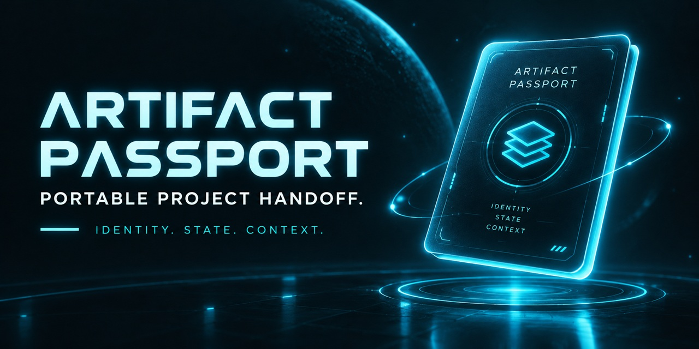

# Artifact Passport

**Carry a project's purpose, decisions, and current working state into the next AI conversation.**

Moving a project into a fresh chat often means explaining it again: which files matter, what already works, what failed, and what the next change must preserve. Artifact Passport puts that context beside the project so the next person or AI has a place to start.

Created by **Wakka** through directing, testing, and iterating with AI. This is an experimental toolkit developed around practical project handoffs.

**Release:** 0.7.1 · **Format:** 0.7 · **License:** [MIT](LICENSE) · **Operation:** offline

## Who it's for

Artifact Passport is for people who need to carry a project's working context forward without rebuilding that context from scratch.

It is especially useful when:

- moving an active project into a fresh AI conversation
- handing work from one person or AI environment to another
- preserving what currently works, what failed, and what must not regress
- keeping project identity, state, and decisions beside the files themselves

## Try it

1. Download and extract `Artifact-Passport-v0.7.1.zip` from this repository's **Releases** section. You can also download the repository using **Code → Download ZIP**, then extract it.
2. Open the extracted `tools` folder.
3. Double-click `Artifact-Passport-Studio-v0.7.html` to open the Studio in your browser. The filename refers to the 0.7 format; it is also used by this 0.7.1 release.
4. Select a project ZIP, JSON file, or extracted folder in the Studio.
5. Review the information found in your files and answer the remaining questions about purpose, boundaries, and current progress.
6. Select **Validate**, then **Export handoff bundle**.
7. Keep the exported bundle with your project. Supply both to the next person or AI continuing the work.

The Studio runs locally without an account, API key, installation, or paid service. The optional command-line tools require Python; you do not need them to use the Studio.

Local intake does not upload your files. If you later attach the project or handoff to an AI service, you are choosing to share those files with that service. Review what you include and keep credentials out of handoffs.

## What travels with the project

| File | What it carries |
| --- | --- |
| `artifact-passport.json` | Lasting identity, purpose, authoritative files, constraints, and verification rules. |
| `artifact-handoff.json` | Current state, known-good point, next objective, failed attempts, decisions, uncertainties, and recent changes. |
| `ARTIFACT.md` | A readable guide generated from the Passport and Handoff. |

The normal export contains these three files. The toolkit also includes [AP-PROTOCOL.md](AP-PROTOCOL.md), a reading protocol for AI consumers.

For example, an offline app's network policy belongs in its durable Passport. A rendering fix that worked, a later attempt that broke movement, and the next planned repair belong in its current Handoff.

## See the included example

Start with the existing [minimal note example](examples/minimal/ARTIFACT.md). It includes a real `note.txt`, its Passport, and its current Handoff. It shows the format with a small artifact you can inspect completely.

To try it in the Studio, use the folder picker and select `examples/minimal`. Review the imported Passport and Handoff, then validate and export a bundle.

The toolkit also includes:

- [An intake example](examples/intake/EXPECTED-INTAKE.md): how facts from a package lockfile become a draft, with owner decisions left open.
- [A reference-application example](examples/officer-reference/ARTIFACT.md): a more detailed sample Passport. The application it describes is not bundled here.
- [The handoff test](HANDOFF_TEST.md): a repeatable comparison of the same project with and without Passport.

## How it handles uncertainty

The Studio distinguishes information extracted from supplied files, suggested interpretations, and questions only the owner can answer. Detected file roles are suggestions for review. Intake uses local detection rules; it does not call an AI model to understand your entire project.

The Handoff can point the receiving AI toward files relevant to its task and away from large binaries, generated outputs, and obsolete material. Its context snapshot records decisions and recent changes without needing a full conversation transcript.

A Passport guides inspection. Its contents do not grant permission to execute commands, upload data, use credentials, or modify files.

## Measuring whether it helps

The optional `artifact-passport-run.json` records observations from a controlled handoff test. It is separate from normal handoff state and is not automatically collected telemetry.

[HANDOFF_TEST.md](HANDOFF_TEST.md) explains how to compare matched control and Passport runs. The comparator reports differences in orientation actions, file reads, clarification, backtracking, and observable timing. Its quality gate checks whether the Passport run understood the project at least as well and independently verified at least as much.

Host-reported tokens or usage can be recorded when available. Missing telemetry remains missing. This release includes the measurement tools and examples; it does not establish a general time-saving or token-saving result.

## Developer checks

Run these commands from the extracted project folder:

```text
python tools/validate_passport.py --self-test
python tools/compare_handoff_runs.py --self-test
node tests/test_studio_intake.js
```

The validator self-test deliberately rejects the invalid fixtures. Those expected failures are followed by `SELF-TEST PASS`.

Validate an exported pair:

```text
python tools/validate_passport.py artifact-passport.json artifact-handoff.json
```

Compare completed benchmark receipts:

```text
python tools/compare_handoff_runs.py control.run.json passport.run.json
```

See [SPECIFICATION.md](SPECIFICATION.md) for field meanings and the trust model, and [CHANGELOG.md](CHANGELOG.md) for the project's evolution.

## Current status

Release 0.7.1 prepares the existing 0.7 toolkit for public sharing: MIT licensing, a clearer front page, and a guide to the bundled example. It does not change Studio or validator behavior.

The toolkit remains experimental. Inventory fingerprints detect filename and size changes; they do not verify every file's contents. ZIP intake skips unsupported archives or entries, including encrypted, ZIP64, multi-disk, oversized, and unsafe-path entries. There is no signing system, cloud registry, automatic execution, or vendor-specific integration.

The automated checks are documented in [VERIFICATION.md](VERIFICATION.md).

## Feedback and forks

Use this repository's **Issues** tab to report a problem or describe your experience. Include the release, browser or AI environment, what you supplied, what you expected, and what happened. Use a small non-sensitive example when possible.

Forks and adaptations are welcome under the [MIT license](LICENSE). A fork is your own version; changes enter this repository only when its maintainer accepts them. Preserve the copyright and license notices when redistributing the code.
